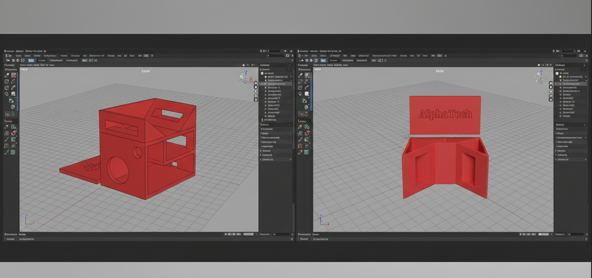
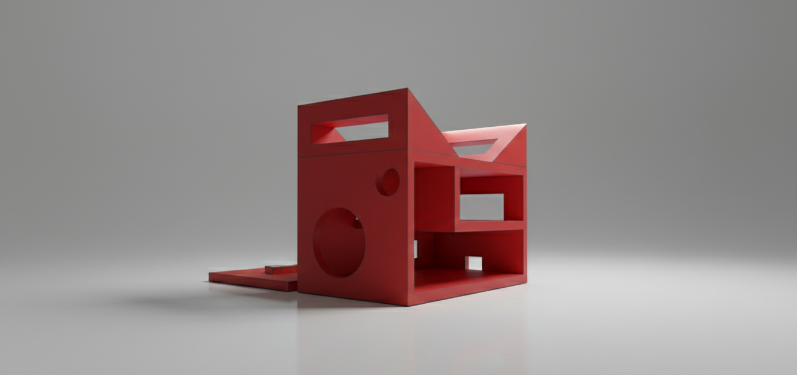

# 🐕 Alpha Tech Smart Collar – ESP32 Firmware

This repository contains the **firmware for the Alpha Tech Smart Collar**, built using **Arduino Core for ESP32**.  
The firmware manages hardware control, Wi-Fi connectivity, backend communication, and remote command execution.

The project is designed as an **always-on IoT device** for pet tracking and remote alert activation.

---

## ⚙️ Overview

The smart collar operates in an **Always-On Polling Mode**, periodically querying the backend API to check for pending commands (e.g. locating a pet) and sending location updates.

Main objectives:
- Remote activation of audible and visual alerts
- Backend-driven command execution
- Location reporting (currently simulated)

---

## 🧠 System Architecture

The firmware follows a simple and reliable polling-based architecture, ideal for ESP32-based IoT devices.

### Communication Flow

| Step | Action | Description |
|-----|-------|-------------|
| 1 | Polling | ESP32 sends `GET /commands/:petId` every 5 seconds |
| 2 | Command Received | Backend responds with `{ "command": "FIND_PET" }` |
| 3 | Execution | ESP32 activates buzzer and LED, then sends location update |
| 4 | Acknowledgment | ESP32 sends `POST /commands/ack` to reset command state |

---

## 🔌 Hardware Components

### Component List

| Component | Purpose |
|----------|--------|
| **ESP32 Dev Module** | Main microcontroller with Wi-Fi |
| **Active / Passive Buzzer** | Audible alert for pet localization |
| **Red / Amber LED** | Visual alert indicator |
| **LED** | Wi-Fi connection status |
| **NPN Transistor (BC547 or similar)** | Protects GPIO and amplifies buzzer signal |
| **Resistors (1kΩ, 220Ω)** | Current limiting and signal protection |
| **18650 Battery (3.7V)** | Power supply |


---

## 🔧 Wiring (Buzzer & LEDs)

| ESP32 Pin | Connection | Description |
|----------|-----------|-------------|
| GPIO 2 | Transistor base (via 1kΩ resistor) | Buzzer control |
| GPIO 4 | Alarm LED (220Ω to GND) | Command indicator |
| GPIO 5 | Status LED (220Ω to GND) | Wi-Fi status |
| GND | LEDs cathodes & transistor emitter | Common ground |
| VIN / 5V | Transistor collector | Buzzer power |

---

## ⚙️ Firmware Configuration

Main file:

Before compiling, configure the following values.

---

### 📚 Required Libraries

Install via **Arduino IDE → Library Manager**:

- `ArduinoJson`

---

### 🌐 Wi-Fi & Backend Configuration

```cpp
const char* ssid = "SSID_DEL_ENTORNO";
const char* password = "PASSWORD_DEL_ENTORNO";

const char* apiUrl = "https://executive-cent-reliability-eva.trycloudflare.com";
const char* locationApiUrl = "https://pacific-fighter-missile-stuffed.trycloudflare.com";

```
## 🧰 Core Firmware Functions

| Function | Description |
|--------|-------------|
| `connectToWiFi()` | Handles Wi-Fi connection and reconnection logic, controls status LED |
| `checkForCommands()` | Polls backend and parses JSON response |
| `executeCommand()` | Executes received command (buzzer, LED, location update) |
| `sendLocationUpdate()` | Sends simulated GPS coordinates |
| `sendAcknowledgment()` | Confirms command execution to backend |

---

## 📍 Location Handling

Location data is currently **simulated**.

This should be replaced with:
- A real GPS module (e.g. **NEO-6M**)
- A compatible geolocation service

---

## 🔋 Power Considerations

The collar runs continuously. Recommended future improvements:
- Deep Sleep integration
- Battery voltage monitoring
- Polling interval optimization

---

## 🚀 Project Status

✔ ESP32 ↔ Backend communication  
✔ Remote command execution  
✔ Audible and visual alerts  
✔ Command acknowledgment (ACK)

### 🔧 Planned Improvements
- Real GPS integration
- Power optimization
- Secure communication (certificate validation)


---

## 🧩 3D Design

Below are the 3D design renders of the Alpha Tech Smart Collar enclosure.

### 3D Design – View 1


### 3D Design – View 2


### 3D Design – View 3


---

## 🔌 Circuit Diagram

The following image shows the electronic circuit used for the ESP32 smart collar, including the buzzer, LEDs, and power connections.


## 📁 Project Structure

```text
alpha-tech-smart-collar/ 
├── images/
│   ├── 3d-design-1.png
│   ├── 3d-design-2.png
│   ├── 3d-design-3.png
│   └── circuit-diagram.png
└── smart_collar.ino
└── README.md
